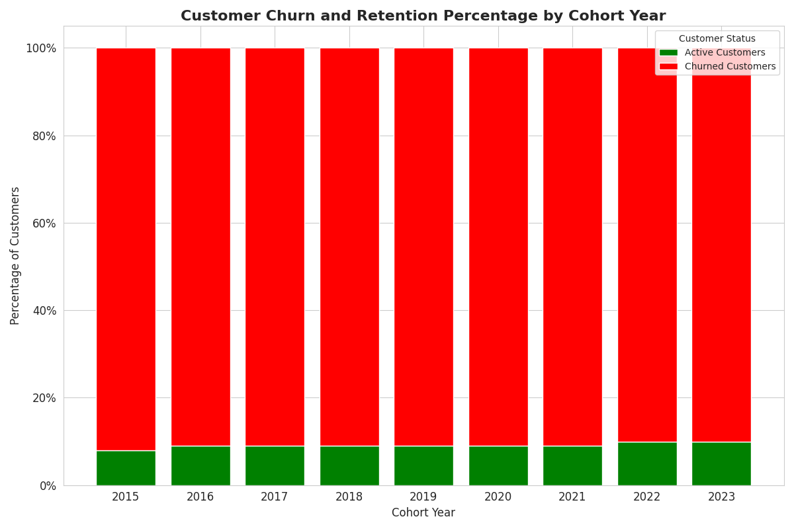

# Contotso 100k - Sales Analysis

## Overview

Analisa perilaku pelanggan (customer behaviour), retensi dan life time value pelanggan untuk perusahaan e-commerce guna meningkatkan retensi pelanggan dan memaksimalkan pendapatan.

## Business Questions

    1. Segmentasi Customer: Who are our most valuable customers ?
    2. Cohort Analysis: How do different customer groups generate revenue ?
    3. Retention Analysis: Which customers haven't purchased recently (churn and customer behaviour)

## Analysis Approach

### 1. Customer Segmentation Analysis

- Kategorikan customer berdasarkan total lifetime value (ltv).
- Berikan tanda untuk tingkat customer mulai dari high, mid dan low-value segments.
- Hitung key metrics: total revenue

[💻 Query untuk customer segmentation](Scripts\q1_customer_segmentation.sql)

**📈 Visualisasi:**

**📊 Key Findings:** - High-value segment (25% of customers) memberikan 66% dari revenue ($144.2 M)

- Mid-value segment (50% of customers) generates 32% dari revenue ($70.6 M)
- Low-value segment ( 25% of customers) accounts for 2% dari revenue ($4.5 M)

⚖ Business Insight - High-value (66% revenue): Offer premium membership program untuk 12,372 VIP customers, as losing one customer significantly impacts revenue.

- Mid-value (32% revenue): Create upgrade paths through personalized promotions, with potensial $70.6M - $144.2M revenue opportunity.
- Low-value (2% revenue): Design re-engangement campaigns and price-sensitive promotions to increase purchase frequency.

### 2. Cohort Analysis

    - Tracked revenue and customer count per cohorts
    - Cohorts were grouped by year of first purchase
    - Analyzed customer retention at a cohort level

[💻 Cohor analysis query](Scripts\q2_cohort_analysis.sql)

**📈 Visualization:**

**📊 Key Findings:**

- Revenue per customer shows an alarming decreasing trend ofer time
  - 2022-2024 cohorts are consistenly performing worse than earlier cohorts
  - Note: Although net revenue is increasing, this is likely due to a larger customer base, which is not reflective of customer value

**⚖ Business Insight:** Value extracted from customers is decreasing over time and needs further investigation.

- In 2023 we saw a drop in numbering of customers acquired, which is concerning.
- With both lowering LTV and decreasing customer acquisition, the company is facing a potential revenue decline.

### 3. Customer Retention

[💻 Query](Scripts\q3_retention_analysis.sql)

    - Identified customer at risk churning
    - Analyzed last purchase patterns
    - Calculated customer-specific metrics

**📈 Visualization**

**📊 Key Findings:** - Cohort churn stablizes at ~90% after 2-3 years, indicating a predictable long-term retention pattern. - Retention rates are consistenly low (8-10%) across all cohorts, suggesting retention issues are systemic rather than specific to certain years. - Newer cohorts (2022-2023) show similar churn trajectories, signaling that without intervention, future cohorts will follow the same pattern.

**📌 Business Insight** : - Strengthen early engagement strategies to target the first 1-2 years with onboarding incentives, loyalty rewards, and personalized offers to improve long-term retention. - Re-engage high-value churned customers by focusing on targeted win-back campaigns rather than broad retention efforts, as reactivating valuable users may yield higher ROI. - Predict & preempt churn risk and use customer-specific warning indicators to proactively intervene with at-risk users before they lapse.

# Strategic Recommendations

1. Customer Value Optimization (Customer Segmentation)
   - Launch VIP program for 12,372 high-value customers (66% revenue)
   - Create personalized upgrade paths for mid-value segment ($66.6M → $135.4M opportunity)
   - Design price-sensitive promotions for low-value segment to increase purchase frequency
2. Cohort Performance Strategy (Customer Revenue by Cohort)
   - Target 2022-2024 cohorts with personalized re-engagement offers
   - Implement loyalty/subscription programs to stabilize revenue fluctuations
   - Apply successful strategies from high-spending 2016-2018 cohorts to newer customers
3. Retention & Churn Prevention (Customer Retention)
   - Strengthen first 1-2 year engagement with onboarding incentives and loyalty rewards
   - Focus on targeted win-back campaigns for high-value churned customers
   - Implement proactive intervention system for at-risk customers before they lapse

# Technical Details

- Database: PostgreSQL
- Analysis Tools: PostgreSQL, DBeaver, PGadmin
- Visualization: ChatGPT and Gemini
